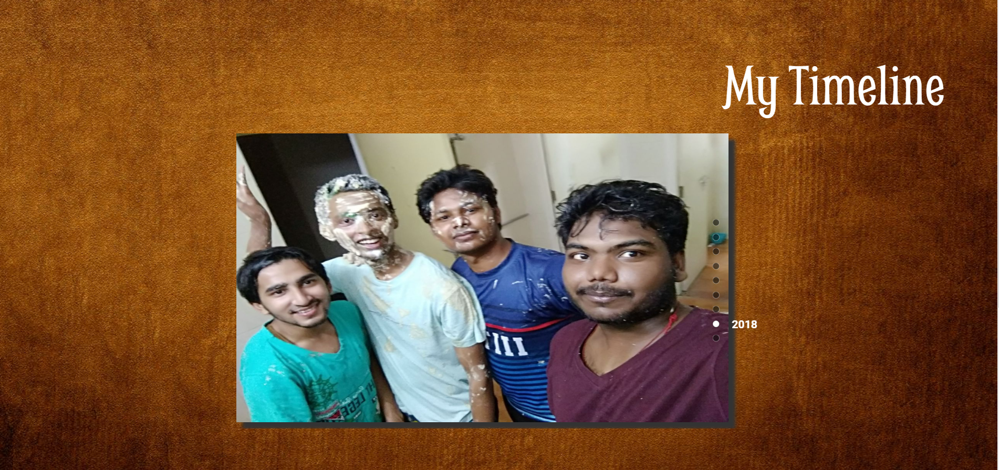
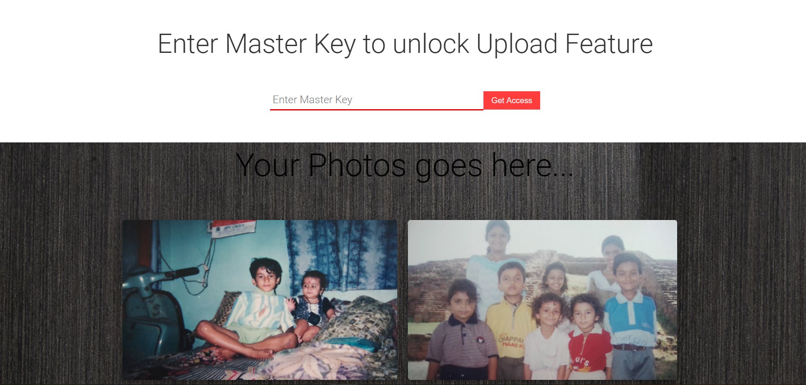
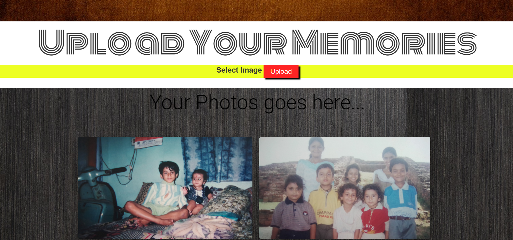

# Little Memory Gallery
This web-app is an online gallery to keep your memories intact. 
In other words, it is a place where you can upload and view your images just as you do in your Google Drive. 
It has a timeline slider were you can place your photos in a yearly manner. This have been done with the help of jssor-slider. 
This app also enable you to upload new images to the gallery only after giving the Master Key set by the admin. This feature secure unauthorized personals from polluting your gallery. 
API used for storing images - # CloudinaryAPI
#
Following is the overview of the app...

<b>College Days!!</b>
#

<b>Page before entering Master Key.</b>
#

</b>Page after entering Master Key</b>
